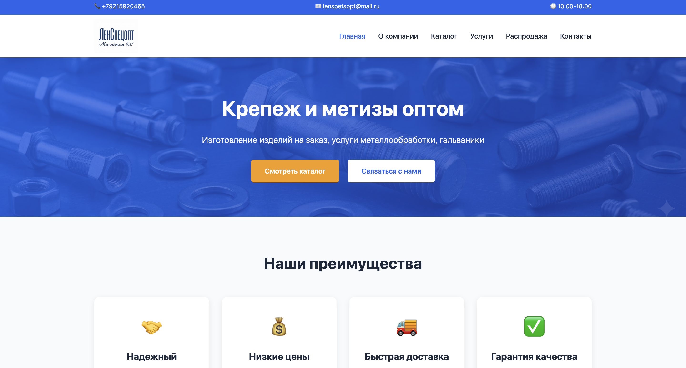
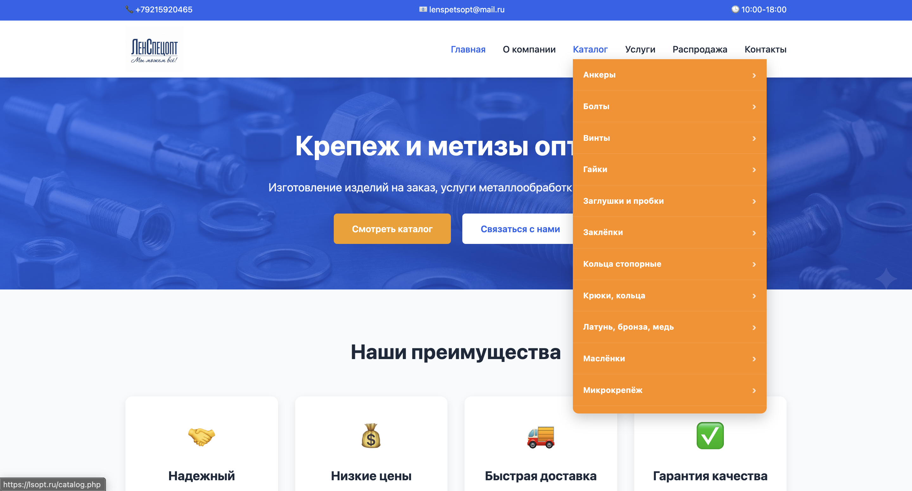
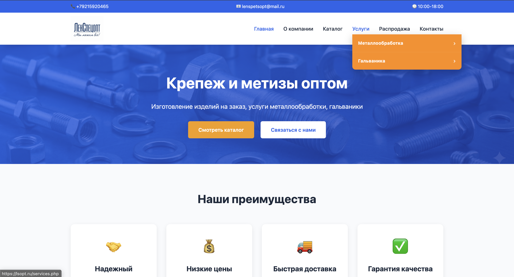

# Lenspecopt Website

Commercial website developed for a real fasteners and metalware supplier. This repository is a portfolio-safe release of the application; production databases, customer requests, credentials, backups, and private client configuration are intentionally excluded.

## Demo

Production: https://lsopt.ru/

## About

Lenspecopt is a catalog and lead-generation website built for a real client. It presents the company's products and services, supports structured catalog content, and provides an administrative interface for day-to-day updates.

## Features

- Responsive multi-page company website
- Product categories, catalog pages, featured products, and sale flags
- Service categories and detail pages
- SQLite-backed editable content and SEO settings
- Administrative interface for products, services, content, and media
- Dynamic metadata and sitemap generation
- Contact form delivery through environment-configured Telegram and SMTP integrations

## Tech Stack

- PHP
- SQLite through PDO
- PHPMailer
- HTML5, CSS3, and vanilla JavaScript
- Apache-compatible `.htaccess` configuration

## Architecture

Page controllers and templates live in the project root. `db.php` provides the SQLite connection and shared data helpers, while the public pages query catalog and settings data directly. `admin.php` contains the content-management interface. `send.php` handles form submissions and optional notification integrations. The public repository ships a minimal fictional dataset in `database/schema.sql`; production data and configuration remain private.

## My role

I implemented the responsive frontend, PHP application structure, catalog and service data model, administrative editing flows, form handling, metadata, and deployment-oriented configuration for the client website.

## Screenshots







## Running locally

Requirements: PHP with the `pdo_sqlite` extension.

```bash
cp .env.example .env
php scripts/init_db.php
set -a
source .env
set +a
php -S localhost:8000
```

Open http://localhost:8000. The sample database contains fictional portfolio data. Set `ADMIN_PASSWORD` to enable admin login; Telegram and SMTP variables are only required to test notification delivery.

## Status

Production commercial project. The live site runs at https://lsopt.ru/; this repository is a sanitized portfolio release and does not contain confidential client information.

